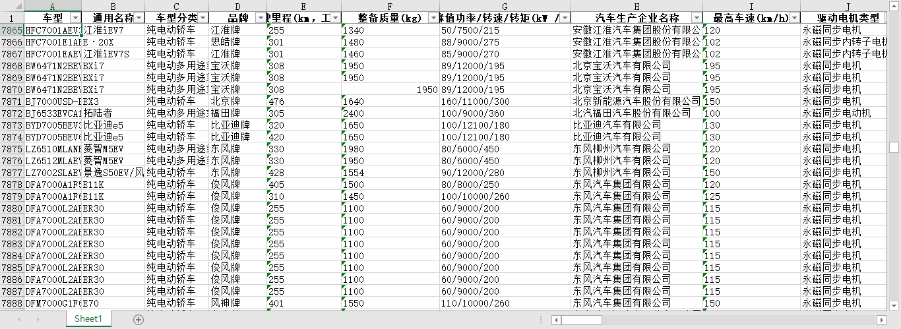

<!--
 * @Author: KivenChen
 * @Date: 2019-04-15
 -->

# 工信部新能源车型配置信息数据爬取

## 使用说明

### 数据来源

爬取的数据来源于以下三部分：

1. 道路机动车辆生产企业及产品，基本为doc文件形式
2. 新能源汽车推广应用推荐车型目录，基本为html形式
3. 免征车辆购置税的新能源汽车车型目录，基本为pdf文件形式

其中数据主要为第2、3部分。

### 项目结构说明

```
vehicles_db/
|-- data/
|   |-- origin_data(由 Spider 爬取的原始文件)
|   |-- output(解析清洗后的 Excel 数据文件)
|   |-- revised_data(对原始文件的备份及修改)
|
|-- DataParser/
|   |-- __init__.py
|   |-- clean_data.py(清洗数据脚本)
|   |-- convert.py(转换文件格式脚本)
|   |-- main.py(数据解析主程序)
|   |-- output.py(输出解析后数据)
|   |-- parse_data.py(对不同文件格式的表格数据进行解析)
|
|-- Spider/
|   |-- __init__.py
|   |-- download.py(下载目标链接的响应内容)
|   |-- main.py(爬虫主程序)
|   |-- output.py(下载目标文件)
|   |-- parse_respa.py(对响应内容进行解析)
|   |-- spider.py(异步爬虫函数)
|   |-- urls.py(构造初始 url)
|
|-- __init__.py
|-- main.py
|-- README
```

### 环境及依赖

- Python 3.X
- pandas
- win32com
- pdfplumber
- docx
- bs4
- aiohttp
- asyncio
- json

### 运行

进入 `vehicles_db` 文件夹，运行 `main.py` 文件即可。

输出数据位于 `/data/output` 文件夹中。

### 输出

部分输出如图所示：

